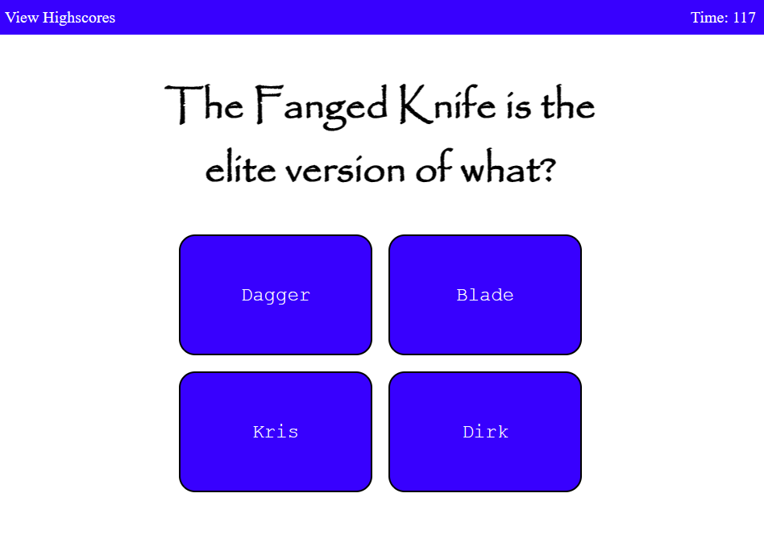

# Javascript Quiz

## Description

This site runs a javascript-based quiz in the browser on Diablo II trivia. Eight questions are pulled from a pool randomly and offered in succession. The quiz is timed, and wrong answers deduct remaining time. If you answer all questions before the time runs out, you can store your score (remaining time) locally and view up to 20 high scores.

## Installation

N/A

## Usage

Click "View Highscores" to the upper-left to see a ranked list of previous highscores. In the opposite top corner is a timer which will run while taking the quiz. After clicking "Start Quiz" you will be presented one-by-one with a series of questions, and four answer buttons for each. Selecting the wrong one will reduce remaining time. If you finish with time left on the clock, you will be prompted to type up to three initials, and store your score in the high scores under them. 

To view the deployed product, visit: https://hornickjohn.github.io/javascript-quiz/

## Credits

N/A

## License

N/A

## As-Deployed Screenshot

